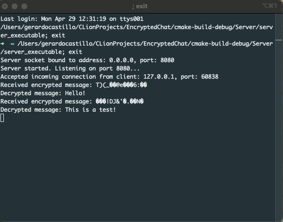
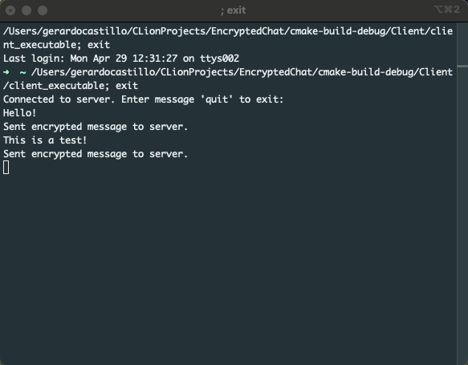

# Client-Server Chat Application with AES-CBC Encryption

## Table of Contents
- [Introduction](#introduction)
  - [Features](#features)
  - [Technologies Used](#technologies-used)
- [Geting Started](#getting-started)
- [Usage](#usage)
- [Security Considerations](#security-considerations)
- [Screenshots](#screenshots)

## Introduction

This project implements a client-server chat application where messages exchanged between clients and the server are encrypted using AES-CBC mode encryption. AES (Advanced Encryption Standard) is a symmetric encryption algorithm widely used for secure communication. CBC (Cipher Block Chaining) mode adds an additional layer of security by XORing each plaintext block with the previous ciphertext block before encryption.

### Features

- **Client-Server Architecture**: The application follows a client-server architecture where multiple clients can connect to a central server to exchange messages securely.
  
- **End-to-End Encryption**: All messages exchanged between the clients and the server are encrypted using AES-CBC mode encryption, ensuring confidentiality and integrity.

- **Interactive Chat Interface**: Clients can send and receive messages in real-time through an interactive command-line interface.

### Technologies Used

- **C++ Programming Language**: The application is developed primarily using C++ to implement the client and server functionalities.

- **OpenSSL Library**: OpenSSL is used to implement AES encryption in CBC mode, providing robust security features for message encryption and decryption.

- **Socket Programming**: Socket programming is utilized to establish communication channels between the clients and the server over the network. [POSIX functions]

## Getting Started

To run the chat application:

Be sure to have OpenSSL library installed

1. Clone the repository to your local machine.
2. Compile and build the client and server executables using the provided build scripts or commands.
3. Start the server by running the server executable.
4. Launch multiple client instances and connect them to the server.
5. Begin sending encrypted messages between the clients and the server.

## Usage

- **Client Interface**: Clients can interact with the chat application through a command-line interface. They can send messages, receive messages from other clients, and view the chat history.

- **Server Management**: The server manages client connections, encrypts and decrypts messages, and facilitates secure communication between multiple clients.

## Security Considerations

- **Key Management**: The application ensures secure key management practices, such as generating and exchanging cryptographic keys securely between the clients and the server.

- **Secure Communication**: AES-CBC encryption provides end-to-end encryption, ensuring that messages exchanged between clients are secure and protected from unauthorized access.

- **Error Handling**: Robust error handling mechanisms are implemented to handle exceptions, prevent data leaks, and maintain the confidentiality of encrypted messages.

## Screenshots

Server

Client

